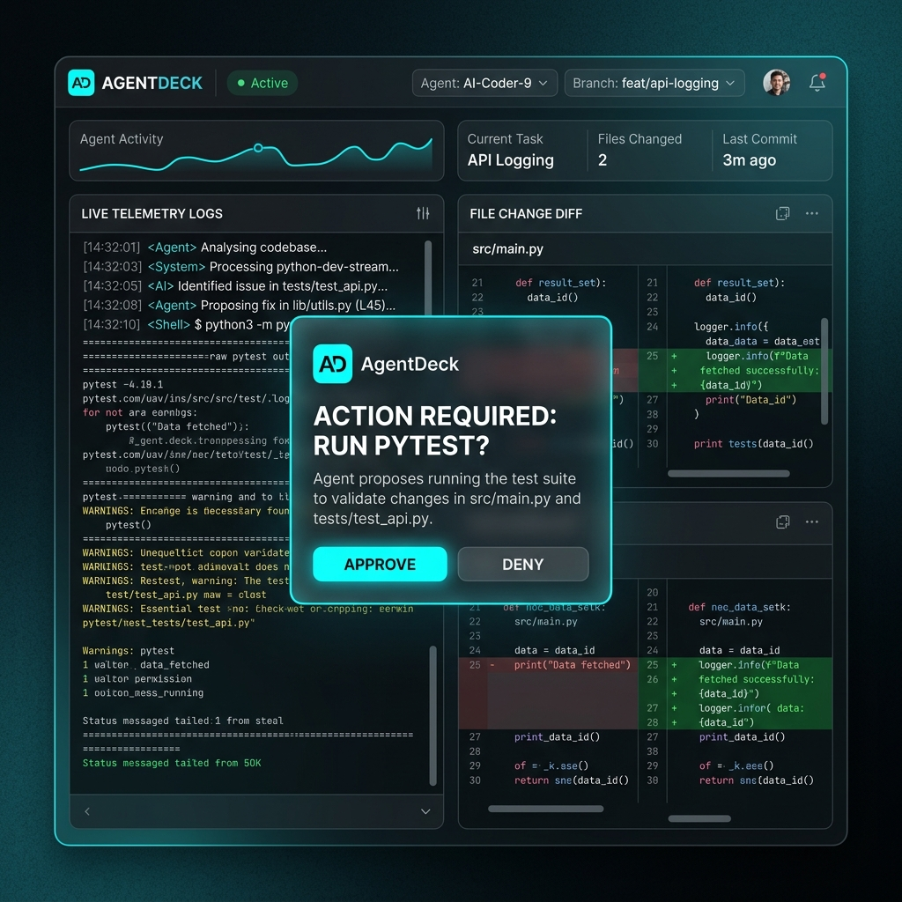

<div align="center">
  <h1>Asterim</h1>
  <p><strong>The AI-native workspace for orchestrating autonomous software engineering agents.</strong></p>
  <p>Asterim is a premium, local-first control plane that brings production-grade multi-agent orchestration directly to your development environment. By keeping data secure on your machine and keeping humans firmly in the loop, Asterim empowers you to coordinate specialized AI agents to solve complex engineering challenges.</p>
</div>

---

## Features

### AI Workspace
A beautifully designed, premium workspace to house all your projects and manage intelligent agents.

### Multi-agent Orchestration
Coordinate multiple specialized AI agents, allowing them to collaborate seamlessly on complex tasks.

### Local-first Architecture
Your code, your data, your machine. Asterim is built to operate locally, ensuring maximum privacy and speed.

### Human Approvals
Engineers maintain ultimate control. Autonomous actions can be gated by human-in-the-loop approvals, ensuring nothing executes without your say-so.

### Cloud Relay
Connect your local Workstations to external or cloud resources securely via the Cloud Relay service.

### Development Workstations
Dedicated, isolated environments where your agents operate, preserving your host system's integrity.

### Real-time Dashboard
Monitor your agents, view logs, and intervene at any time through our responsive, intuitive real-time dashboard.

---

## Screenshots

> *Coming soon.*
>
> 

---

## Installation

```bash
# Clone the repository
git clone https://github.com/your-org/asterim.git
cd asterim

# Install dependencies (requires pnpm)
pnpm install
```

---

## Quick Start

To spin up the local development environment:

```bash
# Start the web client and backend services
pnpm run dev
```

Visit `http://localhost:5173` to access your Asterim dashboard.

---

## Architecture Overview

Asterim is composed of three primary components:
1. **Web Client**: A modern, responsive React UI.
2. **Server (Control Plane)**: A Fastify-based backend that manages orchestration, event buses, and mDNS discovery.
3. **Adapters**: Connectors that interface with different AI models (e.g., Claude, Antigravity) to act as specialized agents.

All components communicate asynchronously via an internal EventBus.

---

## Monorepo Structure

```text
asterim/
├── apps/
│   ├── web/        # The React frontend workspace
│   ├── server/     # The Fastify backend service
│   └── relay/      # The Cloud Relay service
├── packages/
│   ├── shared/     # Shared types and utilities
│   └── adapters/   # Agent adapters (Claude, Aider, etc.)
└── blueprint/      # Comprehensive project documentation
```

---

## Development

We use `turbo` to manage our monorepo tasks.

- `pnpm run build`: Build all packages and applications.
- `pnpm run lint`: Run ESLint across the repository.
- `pnpm run clean`: Clean build artifacts.

---

## Roadmap

To see what we're working on next, check out our [Roadmap](./blueprint/ROADMAP.md).

---

## Documentation

The definitive requirements and documentation for Asterim live in the `blueprint/` directory.

- **[Product Specification](./blueprint/PRODUCT.md)**: Why we are building this.
- **[Architecture Details](./blueprint/ARCHITECTURE.md)**: How the system works.
- **[Brand Guidelines](./blueprint/BRAND.md)**: Voice, tone, and brand rules.
- **[AI Context](./blueprint/AI_CONTEXT.md)**: Context tailored specifically for AI agents.

---

## Contributing

We welcome contributions! Please review our [Governance](./blueprint/GOVERNANCE.md) and development guides before submitting a pull request.

---

## License

MIT
