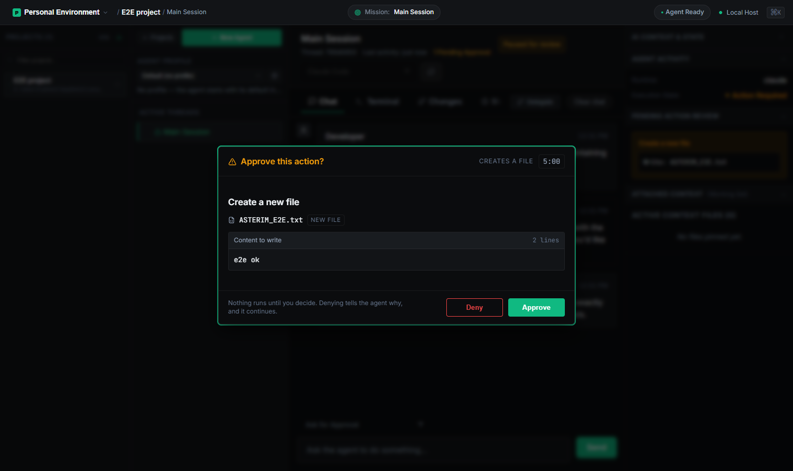

# Asterim

**Works with the Claude Code you already run. See what your coding agent is doing, approve what matters, and keep the record.**

Asterim runs Claude Code on your machine, shows you what it says and does in a browser, and stops it before every command or file write until you say yes. Approvals, denials, tool calls and diffs are stored in a SQLite file you own. Nothing leaves the machine except the agent's own API calls.

Longer term Asterim is a local-first control layer for AI coding agents — the projects, tasks, permissions, context and history around them, independent of any one provider. Today it does the first piece of that, for one agent, well. See [PROJECT_CONTEXT.md](PROJECT_CONTEXT.md).

Open source, MIT. No account, no telemetry. Windows, macOS, Linux. Node 22+.



## Install

```bash
npm install -g asterim
asterim
```

Asterim prints a local URL, a LAN URL and a six-digit PIN. Open the URL in any browser on the same network and enter the PIN.

If the package is not on npm yet (see `docs/product/roadmap.md`, P0-06), run from source:

```bash
git clone https://github.com/qhukz13/Asterim.git && cd Asterim
pnpm install && pnpm run build
node apps/server/dist/index.js
```

## What happens next

1. **Add a project.** The absolute path of a folder on this machine. Claude Code runs there and only there.
2. **Give it a task.** The transcript shows the agent's messages, tool calls and results.
3. **Approve or deny.** Every command and file write the agent proposes appears as a card with the exact command or path. Nothing runs until you decide.
4. **Review the diff.** The Changes view shows what changed. You commit; the agent never does.

Threads remember their Claude Code session and resume after a restart.

## Agents

| Agent | Status | How |
| --- | --- | --- |
| Claude Code | Working | Headless stream protocol; permission prompts answered through the approval card; sessions resumed by id. |
| Antigravity (Google) | Best effort | Terminal interface scraped by a state machine. |
| Aider, Codex | Not supported | |

## Security model

Asterim runs as you; the agent runs as you. Asterim adds a gate, not a sandbox, and never passes the flag that skips permissions. The dashboard is served over plain HTTP on your LAN behind a PIN; do not expose it to the internet (`HOST=127.0.0.1` keeps it on this machine). Details: `docs/architecture/authentication.md`, `docs/audit/security-audit.md`.

## Privacy

Asterim makes no outbound network connections of its own. There is no account, no analytics, no crash reporting and no usage ping. Claude Code talks to Anthropic exactly as it does without Asterim; Asterim neither proxies nor inspects that traffic.

What leaves your machine, in full:

| Leaves | To | When |
| --- | --- | --- |
| Your prompts and the files the agent reads | Anthropic, by Claude Code itself | Whenever the agent runs, with or without Asterim |
| Nothing else | | |

What stays, in full:

| Stored | Where | Contains |
| --- | --- | --- |
| Projects, threads, events, approvals | `~/.asterim/asterim.db` | Prompts, agent messages, tool calls, commands, paths |
| Application and crash logs | `~/.asterim/server.log`, `~/.asterim/crash.log` | Log lines with vault secrets redacted |
| Pairing PIN and device tokens | `~/.asterim/` | Credentials for browsers you paired |

Delete `~/.asterim` and all of it is gone. Set `ASTERIM_DATA_DIR` to keep it somewhere else.

`asterim stats`, and Settings in the dashboard, show how much you have used Asterim: sessions, threads, agent turns, approvals by outcome. It is computed from your own database on demand, it contains no names, paths, prompts or commands, and it is sent nowhere. Copying it into a conversation is your decision alone.

If an opt-in usage ping is ever added it will be off by default, documented here, and its source will be one file.

## Configuration

`PORT`, `HOST`, `ASTERIM_DATA_DIR`, `ASTERIM_SOVEREIGN_MODE`, `ASTERIM_CLAUDE_BIN`, `ASTERIM_CLAUDE_DISABLE_HOOKS`, `MOCK_AGENT`. See `.env.example`.

## Development

```bash
pnpm install
pnpm run typecheck && pnpm run lint && pnpm run test && pnpm run build
pnpm --filter asterim dev            # Core from source on :3001 (dev channel)
```

Start with `PROJECT_CONTEXT.md`, then `docs/README.md`. Contributors and coding agents: `AGENTS.md`.

## Status

Audited and re-scoped on 2026-09-08. The core loop is verified end to end (`tools/e2e/core-loop.mjs`). Everything beyond it in the repository (team agents, pipelines, enterprise policy, accounts, billing, relay) is frozen and hidden until the core loop has users. Roadmap: `docs/product/roadmap.md`.

## Licence

MIT. See `LICENSE`.
