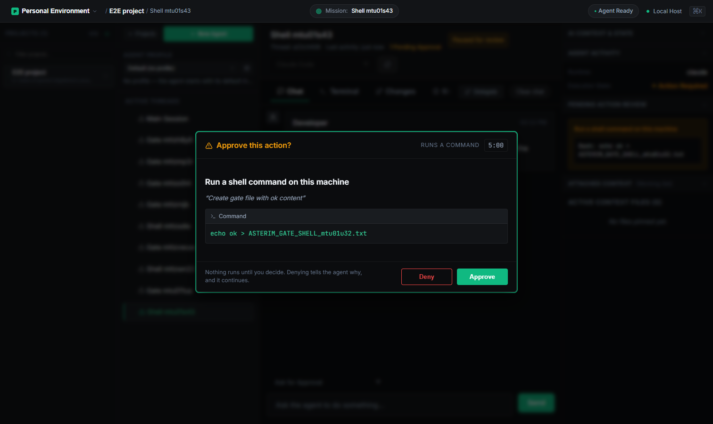
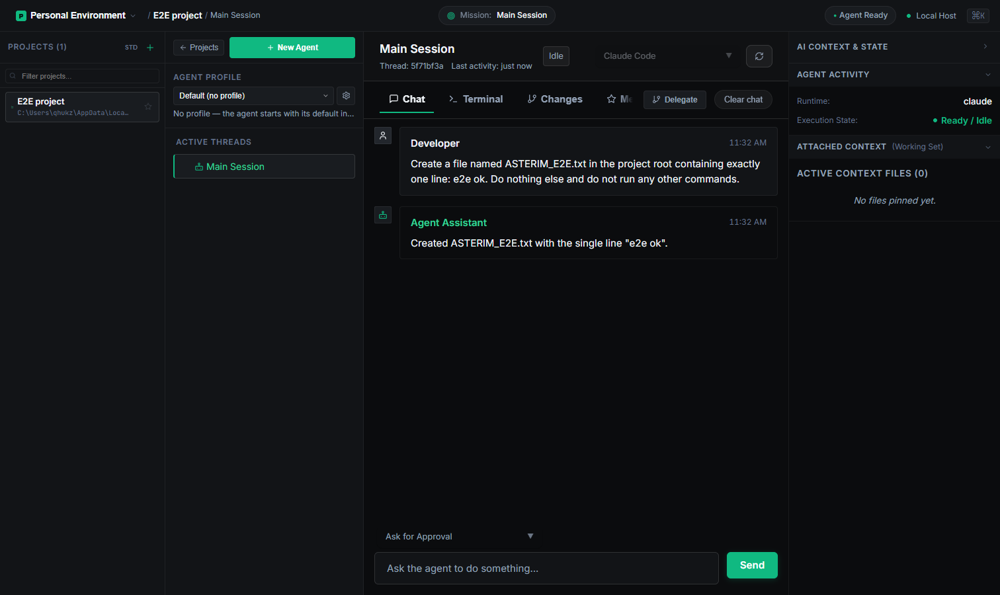
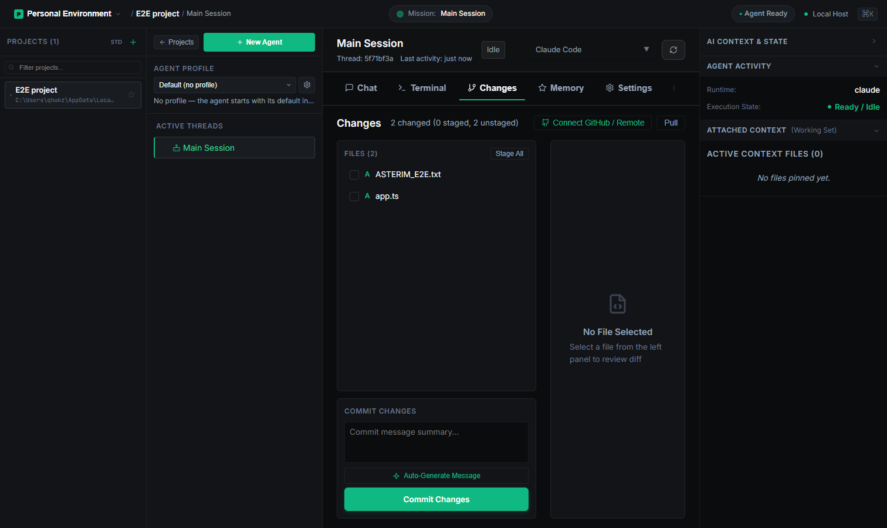
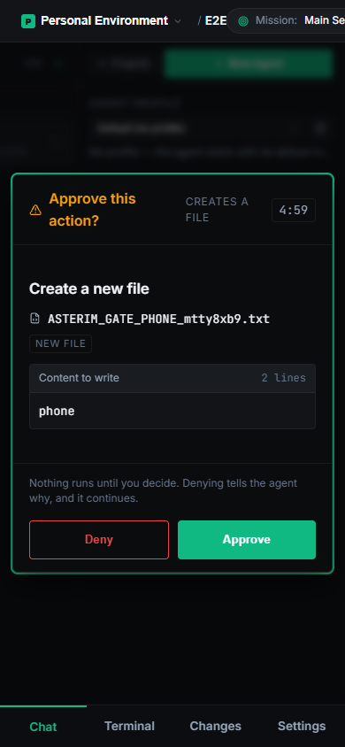
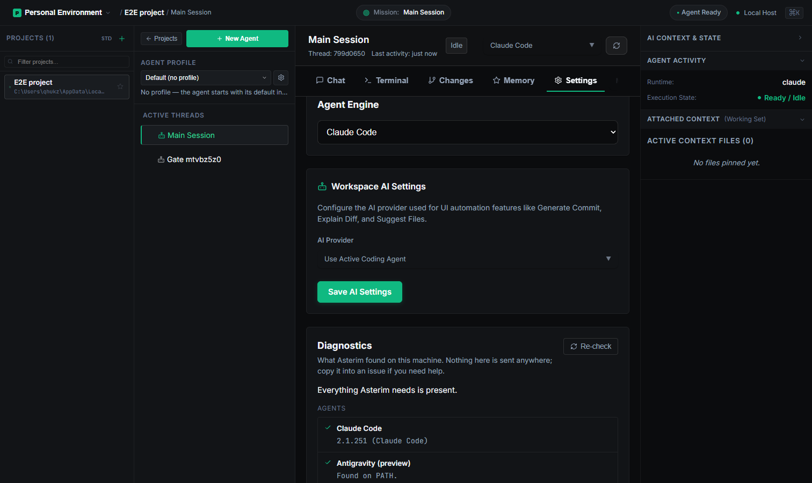

# Asterim

**Works with the Claude Code you already run. See what your coding agent is doing, approve what matters, and keep the record.**

Asterim runs Claude Code on your machine, shows you what it says and does in a browser, and stops it before every command or file write until you say yes. Approvals, denials, tool calls and diffs are stored in a SQLite file you own. Nothing leaves the machine except the agent's own API calls.

Longer term Asterim is a local-first control layer for AI coding agents — the projects, tasks, permissions, context and history around them, independent of any one provider. Today it does the first piece of that, for one agent, well. See [PROJECT_CONTEXT.md](PROJECT_CONTEXT.md).

Open source, MIT. No account, no telemetry. Windows, macOS, Linux. Node 22+.

## The moment it matters

Claude Code will not run a command or write a file without permission. Asterim shows you exactly what it wants to do, and nothing happens until you answer.


A command gets the same treatment: the agent's own description of what it is doing, and the exact command it would run.



Deny, and the command does not run. The agent is told why and carries on.

This is Claude Code's own permission protocol, not a confirmation dialog bolted on top. The request arrives as a `can_use_tool` control request and the answer goes back as the `control_response` the CLI is blocking on. Asterim never passes `--dangerously-skip-permissions`, and it never answers on your behalf.

## Install

```bash
npm install -g asterim
asterim
```

Asterim prints a local URL, a LAN URL and a six-digit PIN. Open the URL in any browser on the same network and enter the PIN.

The package is not published yet (see `docs/product/roadmap.md`, P0-06). Until it is, run from source:

```bash
git clone https://github.com/qhukz13/Asterim.git && cd Asterim
pnpm install && pnpm run build
node apps/server/dist/index.js
```

## What happens next

**1. Add a project.** The absolute path of a folder on this machine. Claude Code runs there and only there. A folder that does not exist is refused, and says so.

**2. Give it a task.** The transcript shows the agent's messages, tool calls and results as structured events, not scraped terminal text.



**3. Approve or deny.** Every command and file write appears as a card. Nothing runs until you decide.

**4. Review the diff.** The Changes view shows what changed, file by file. You commit; the agent never does.



Threads remember their Claude Code session and resume after a restart.

### From a phone

On the same Wi-Fi, open the dashboard URL on your phone and enter the PIN. When the agent asks for something, the card fills the screen and you answer it there. The rest of the dashboard is built for a desktop window and is cramped on a phone.



## Agents

| Agent | Status | How |
| --- | --- | --- |
| Claude Code | Working | Headless stream protocol; permission prompts answered through the approval card; sessions resumed by id. |
| Antigravity (Google) | Preview | Terminal interface scraped by a state machine; breaks when the TUI changes. |
| Aider, Codex | Not supported | No adapter. Codex is revisited when its CLI exposes a permission protocol. |

## Security model

Asterim runs as you; the agent runs as you. Asterim adds a gate, not a sandbox, and never passes the flag that skips permissions.

The only credential is the pairing PIN. It is regenerated on every start, four wrong attempts lock the address for about fifteen minutes, and no API route answers without a token. The account system in the repository is frozen and switched off; it does not grant access to anything.

The dashboard is served over plain HTTP on your LAN. Do not expose it to the internet. `HOST=127.0.0.1` keeps it on this machine.

Details: `docs/architecture/authentication.md`. Findings and their status: `docs/audit/security-audit.md`.

## Privacy

Asterim makes no outbound network connections of its own. There is no account, no analytics, no crash reporting and no usage ping. Claude Code talks to Anthropic exactly as it does without Asterim; Asterim neither proxies nor inspects that traffic.

What leaves your machine, in full:

| Leaves | To | When |
| --- | --- | --- |
| Your prompts and the files the agent reads | Anthropic, by Claude Code itself | Whenever the agent runs, with or without Asterim |
| Nothing else | | |

What stays, in full:

| Stored | Where | Contains |
| --- | --- | --- |
| Projects, threads, events, approvals | `~/.asterim/asterim.db` | Prompts, agent messages, tool calls, commands, paths |
| Application and crash logs | `~/.asterim/server.log`, `~/.asterim/crash.log` | Log lines with vault secrets redacted |
| Pairing PIN and device tokens | `~/.asterim/` | Credentials for browsers you paired |

Delete `~/.asterim` and all of it is gone. Set `ASTERIM_DATA_DIR` to keep it somewhere else.

`asterim stats`, and Settings in the dashboard, show how much you have used Asterim. It is computed from your own database on demand, contains no names, paths, prompts or commands, and is sent nowhere. Copying it into a conversation is your decision alone.



If an opt-in usage ping is ever added it will be off by default, documented here, and its source will be one file.

## Command line

The same binary is the workstation and the tool that operates on its database. These commands never start a server.

```bash
asterim                    # start the Core
asterim stats              # how much this machine has used Asterim; local, sent nowhere
asterim db:status          # schema version, migration history, snapshots
asterim db:snapshot        # take a snapshot now and prune older ones
asterim data:backup        # write a standalone copy of the database
asterim --help             # everything else
```

## Configuration

| Variable | What it does |
| --- | --- |
| `PORT` | Port to listen on. Defaults to 3000 on the stable channel, 3001 on dev. |
| `HOST` | Interface to bind. `127.0.0.1` keeps the Core off the network entirely. |
| `ASTERIM_DATA_DIR` | Where the database and logs live. Defaults to `~/.asterim`. |
| `ASTERIM_CHANNEL` | `stable` or `dev`. Separate ports and separate data directories. |
| `ASTERIM_SOVEREIGN_MODE` | Air-gap switch. Disables every frozen cloud feature outright. |
| `ASTERIM_CLAUDE_BIN` | Path to the Claude Code binary, when it is not on `PATH`. |
| `ASTERIM_CLAUDE_DISABLE_HOOKS` | Runs the agent with your own Claude Code hooks off, so the approval card is the only thing deciding. |
| `ASTERIM_RELAY_URL` | Opt-in for the frozen relay. Unset, the Core connects to nothing. |
| `ASTERIM_ENABLE_ACCOUNTS` | Opt-in for the frozen account system. Leave it off. |
| `MOCK_AGENT` | Replaces the Antigravity adapter with a scripted mock, for demos. |

## Development

```bash
pnpm install
pnpm run typecheck && pnpm run lint && pnpm run test && pnpm run build
pnpm --filter asterim dev            # Core from source on :3001 (dev channel)
```

Two end-to-end harnesses drive the real dashboard against a running Core with puppeteer:

```bash
# pair → project → task → deny → approve → file on disk → diff
ASTERIM_URL=http://localhost:3000 ASTERIM_PIN=<pin> ASTERIM_PROJECT_PATH=<repo> \
  node tools/e2e/core-loop.mjs

# a bad project path, the card on a phone, a shell command, surviving a restart
ASTERIM_URL=http://localhost:3000 ASTERIM_PIN=<pin> ASTERIM_PROJECT_PATH=<repo> \
  node tools/e2e/gate-checks.mjs
```

Start with `PROJECT_CONTEXT.md`, then `docs/README.md`. Contributors and coding agents: `AGENTS.md`.

## Status

Release candidate for 0.2.0. The core loop is verified end to end against the packaged build on a clean machine, both ways: approving puts the file on disk, denying leaves it absent and the agent explains. See `docs/RELEASE_CANDIDATE.md` for what was measured, what is still open, and what has to happen before anyone else is invited.

Everything beyond the core loop in this repository — team agents, pipelines, enterprise policy, accounts, billing, relay — is frozen and switched off until the core loop has users. It is kept rather than deleted because several of those subsystems are the existing implementations of hypotheses the first users will test (`docs/decisions/ADR-005-frozen-code-disposition.md`).

Known limits, written down rather than discovered: `docs/release-gate.md` § Known accepted risks.

## Licence

MIT. See [LICENSE](LICENSE).
