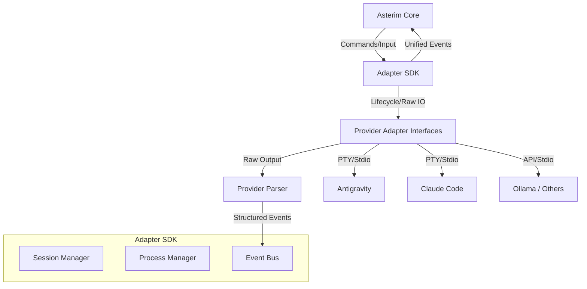

# Asterim Adapter SDK Specification

## Vision
The Asterim Adapter SDK is the official interface between Asterim Core and all AI coding agents. Asterim Core communicates exclusively with the SDK, never with provider-specific implementations (e.g., Claude Code, Codex, Ollama). The SDK manages the heavy lifting (process management, event routing, session management), so adding a new provider only requires implementing a lightweight adapter consisting of a parser, capabilities declaration, and process launch logic.

## SDK Goals
1. **Decouple Core from Providers**: Core must contain zero provider-specific logic.
2. **Minimize Provider Complexity**: Adapters should be ~100-300 lines of code.
3. **Unified Event Stream**: All providers emit a standardized, predictable event stream.
4. **Extensibility**: Support 10+ future providers (local, cloud, enterprise) without Core changes.

## Architecture


## Provider Responsibilities
A new provider implementation must provide:
1. **Capability Declaration**: What features the provider supports.
2. **Process Launch**: How to start the specific provider binary or API connection.
3. **Parser**: Translating raw stdout/stderr into the unified SDK event stream.

Providers *do not* manage PTY instances, sessions, or reconnection logic.

## Capabilities
Capabilities dictate what UI features Asterim enables.
```typescript
interface AdapterCapabilities {
  supportsDiff: boolean;
  supportsTerminal: boolean;
  supportsInterrupt: boolean;
  supportsResume: boolean;
  supportsVision: boolean;
  supportsApproval: boolean;
  supportsNotifications: boolean;
  supportsContextFiles: boolean;
  supportsMultiSession: boolean;
  supportsRemoteExecution: boolean;
  supportsStreaming: boolean;
}
```

## Session Management
The SDK (`SessionManager`) owns:
- Session IDs and lifecycle.
- Parallel sessions.
- Reconnect and Resume logic.
- Interrupts, cleanup, heartbeats, and timeouts.

## Process Management
The SDK provides reusable process management blocks (`ProcessManager`), handling:
- PTY integration and raw TTY management.
- Environment variables and working directories.
- Exit handling and auto-restarts.

## Event Protocol
All providers emit standardized events via the SDK Event Bus. Everything in Asterim consumes these events:
- `AgentStarted`, `AgentStopped`, `AgentError`
- `AgentBusy`, `AgentIdle`
- `TerminalOutput`
- `ChatMessage`
- `ToolCallStarted`, `ToolCallFinished`
- `DiffCreated`
- `ContextUpdated`
- `TokenUsage`
- `ProgressChanged`
- `ApprovalRequested`
- `Notification`, `Heartbeat`

## Message Protocol (Parser)
Every provider outputs different formats (JSON, plain text, ANSI-heavy TUIs). The SDK exposes an `IParser` interface.
- **Input**: Raw chunk of stdout/stderr or terminal diff.
- **Output**: Array of structured SDK events (e.g., `ChatMessage`, `ToolCall`).

## Notifications
The SDK emits high-level notifications that UI can subscribe to, abstracting provider specifics:
- Mission completed
- Approval required
- Agent crashed
- Long running task finished
- Terminal exited

## Future Compatibility
The SDK is designed as a standalone public API. Future extensions may include:
- Pluggable authentication layers for remote cloud adapters (Cloud execution, enterprise wrappers).
- Support for stateless REST/HTTP API providers seamlessly wrapped as stateful sessions.
