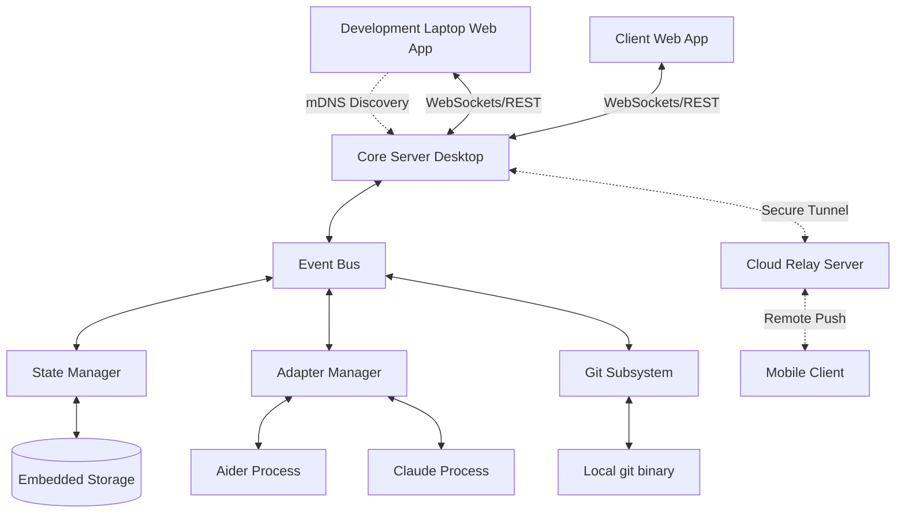
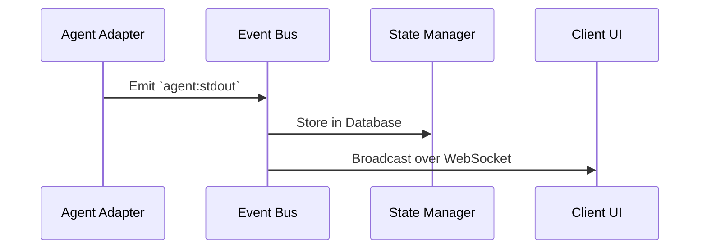

# System Architecture Specification

## Level 1: Product Principles

- The architecture MUST prioritize local execution.
- Security MUST be enforced at the boundary of agent adapters.

## Purpose

This document is the normative architectural specification. It defines the capabilities each subsystem MUST possess, separated from the technologies currently used to satisfy those capabilities.

## 1. System Overview

## 2. Core Runtime

The central orchestrator that manages state and communication.

- **Responsibilities**: The Core MUST initialize the Database, start the Event Bus, mount the API, and initialize the Git Subsystem.
- **Level 4 Current Implementation**: Node.js, Fastify.
- **Alternatives Considered**: Go (compiled binary), Rust (high performance).
- **Trade-offs**: Node.js allows maximum code sharing with the React frontend and fast prototyping, but suffers from higher memory usage and single-threaded performance bottlenecks.
- **Reasoning**: Developer speed and ecosystem (NPM) trump raw performance for an orchestration layer.

## 3. Event Bus

The nervous system of Asterim.

- **Requirements**: The system MUST implement a Publish/Subscribe pattern. Components MUST communicate asynchronously. The bus MUST support wildcard subscriptions for global logging.
- **Level 4 Current Implementation**: Node.js `EventEmitter` with literal `'*'` string convention (ADR-008).
- **Future Evolution**: The current implementation is fragile. It SHALL be migrated to a true wildcard implementation like `mitt` or `RxJS`.

## 4. Adapters

The translation layer isolating the Core from third-party tools.

- **Requirements**: Adapters MUST isolate third-party agents from the Core. If an agent crashes, it MUST NOT crash the Core. Adapters MUST normalize stdout/stderr into standard JSON events.
- **Level 4 Current Implementation**: Node `child_process` with `node-pty`.
- **Alternatives**: Docker containers, WebAssembly.
- **Trade-offs**: Child processes are easy but vulnerable to local environment quirks. Docker is safer but requires heavy user setup.
- **Reasoning**: Start with child processes for frictionless UX. Enterprise features may require Docker isolation later.

## 5. Storage

- **Requirements**: The system MUST store historical sessions, agent output, and user configurations. The storage MUST be fully embedded and require zero user setup.
- **Level 4 Current Implementation**: `node:sqlite`.
- **Reasoning**: SQLite provides ACID compliance without a dedicated database server.

## 6. Networking & Discovery

- **Requirements**: The local UI MUST automatically discover the local Core server.
- **Level 4 Current Implementation**: ZeroConf / Bonjour service broadcasting.

## 7. Cloud Relay

- **Requirements**: The system MUST provide a secure way to tunnel local WebSocket connections to the public internet for remote management, without opening local firewall ports.
- **Level 4 Current Implementation**: Not yet built. Architecture will likely utilize reverse WebSockets or a persistent TCP tunnel.

## Future Evolution

The architecture is designed to eventually support multi-machine agent swarms. The Event Bus and Adapters MUST NOT assume they are running on the same physical hardware as the Core.

## Historical Decisions (ADRs)

Historical Architectural Decision Records (like ADR-008: EventBus Wildcards) dictate the current Level 4 implementations. These are considered technical debt and are tracked in the audit reports (`audit/IMPLEMENTATION_DRIFT.md`) for future deprecation.
