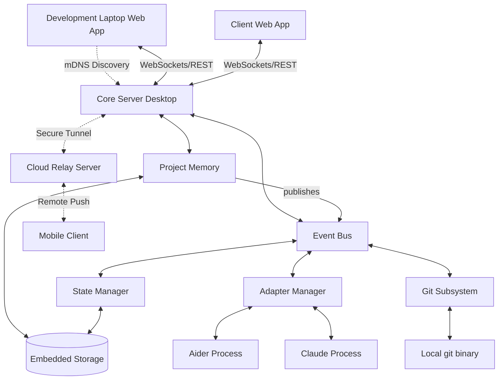
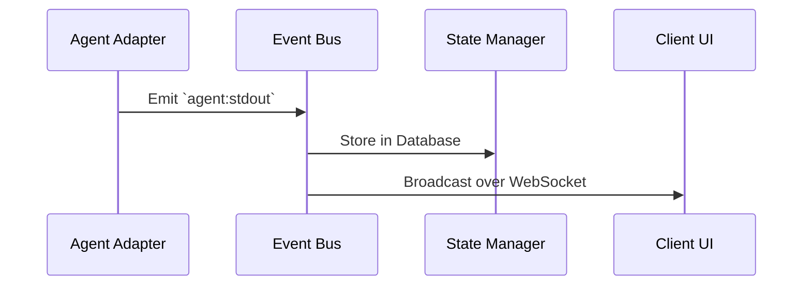

# System Architecture Specification

## Level 1: Product Principles

- The architecture MUST prioritize local execution.
- Security MUST be enforced at the boundary of agent adapters.

## Purpose

This document is the normative architectural specification. It defines the capabilities each subsystem MUST possess, separated from the technologies currently used to satisfy those capabilities.

## 1. System Overview

```mermaid
graph TD
    Laptop[Development Laptop Web App] -.->|mDNS Discovery| API
    Laptop <-->|WebSockets/REST| API
    UI[Client Web App] <-->|WebSockets/REST| API[Core Server Desktop]
    API <--> Bus[Event Bus]
    API <--> Memory[Project Memory]
    Bus <--> State[State Manager]
    Bus <--> AdapterManager[Adapter Manager]
    Bus <--> GitService[Git Subsystem]
    GitService <--> GitCLI[Local git binary]
    AdapterManager <--> Aider[Aider Process]
    AdapterManager <--> Claude[Claude Process]
    Memory -->|publishes| Bus
    Memory <--> DB
    State <--> DB[(Embedded Storage)]

    API <-.->|Secure Tunnel| Relay[Cloud Relay Server]
    Relay <-.->|Remote Push| Mobile[Mobile Client]
```

## 2. Core Runtime

The central orchestrator that manages state and communication.

- **Responsibilities**: The Core MUST initialize the Database, start the Event Bus, mount the API, and initialize the Git Subsystem.
- **Level 4 Current Implementation**: Node.js, Fastify.
- **Alternatives Considered**: Go (compiled binary), Rust (high performance).
- **Trade-offs**: Node.js allows maximum code sharing with the React frontend and fast prototyping, but suffers from higher memory usage and single-threaded performance bottlenecks.
- **Reasoning**: Developer speed and ecosystem (NPM) trump raw performance for an orchestration layer.

## 3. Event Bus

The nervous system of Asterim.

- **Requirements**: The system MUST implement a Publish/Subscribe pattern. Components MUST communicate asynchronously. The bus MUST support wildcard subscriptions for global logging.
- **Level 4 Current Implementation**: Node.js `EventEmitter` with literal `'*'` string convention (ADR-008).
- **Future Evolution**: The current implementation is fragile. It SHALL be migrated to a true wildcard implementation like `mitt` or `RxJS`.

```mermaid
sequenceDiagram
    participant Adapter as Agent Adapter
    participant Bus as Event Bus
    participant State as State Manager
    participant UI as Client UI

    Adapter->>Bus: Emit `agent:stdout`
    Bus->>State: Store in Database
    Bus->>UI: Broadcast over WebSocket
```

## 4. Adapters

The translation layer isolating the Core from third-party tools.

- **Requirements**: Adapters MUST isolate third-party agents from the Core. If an agent crashes, it MUST NOT crash the Core. Adapters MUST normalize stdout/stderr into standard JSON events.
- **Level 4 Current Implementation**: Node `child_process` with `node-pty`.
- **Alternatives**: Docker containers, WebAssembly.
- **Trade-offs**: Child processes are easy but vulnerable to local environment quirks. Docker is safer but requires heavy user setup.
- **Reasoning**: Start with child processes for frictionless UX. Enterprise features may require Docker isolation later.

## 5. Storage

- **Requirements**: The system MUST store historical sessions, agent output, and user configurations. The storage MUST be fully embedded and require zero user setup.
- **Level 4 Current Implementation**: `node:sqlite`.
- **Reasoning**: SQLite provides ACID compliance without a dedicated database server.

## 6. Networking & Discovery

- **Requirements**: The local UI MUST automatically discover the local Core server.
- **Level 4 Current Implementation**: ZeroConf / Bonjour service broadcasting.

## 7. Cloud Relay

- **Requirements**: The system MUST provide a secure way to tunnel local WebSocket connections to the public internet for remote management, without opening local firewall ports.
- **Level 4 Current Implementation**: Not yet built. Architecture will likely utilize reverse WebSockets or a persistent TCP tunnel.

## 8. Project Memory

The subsystem that gives a Project continuity across Threads, agents, and processes. Domain entities are specified in `DOMAIN_MODEL.md` § Project Memory.

- **Requirements**:
  - The system MUST persist project-scoped decisions, their code anchors, the current project intent, and standing architectural rules.
  - Memory MUST be strictly scoped by Project. No read path MAY return records belonging to another Project.
  - The system MUST be able to assemble a **ProjectBriefing** — the memory snapshot handed to an agent beginning work.
  - A briefing MUST be deterministic. The same stored state MUST produce a byte-identical briefing, which requires every query to define a total order rather than relying on timestamps alone.
  - A briefing MUST NOT be produced by a language model, sampling, or any non-reproducible summarization.
  - Recent agent activity in a briefing MUST be derived from existing AgentExecution and Approval records. A parallel activity log MUST NOT be introduced.
  - Decision supersession MUST be atomic: a decision is never left `SUPERSEDED` without its replacement existing.
  - A Project MUST have at most one `ACTIVE` intent; archive-and-replace MUST be atomic.
  - Retired decisions MUST be retained, never deleted. Memory MUST cascade only on Project deletion.
  - Memory mutations MUST be published on the Event Bus.
  - The persistence layer MUST reject writes that reference a non-existent Project.

- **Level 4 Current Implementation**: `ProjectMemoryService.ts`, a singleton over four SQLite tables — `project_decisions`, `decision_code_refs`, `project_intents`, `architectural_rules` — with `ON DELETE CASCADE` to `projects(id)`. Multi-statement writes run in explicit transactions. Enum-like columns are validated in the service, since SQLite cannot add a `CHECK` constraint to an existing table. Types are shared through `@asterim/shared` (`packages/shared/src/types/memory.ts`).

- **Alternatives Considered**: A vector store with embedding-based retrieval; a model-generated rolling summary; Markdown files in the repository.

- **Trade-offs**: Relational storage with exact-match relevance lookup cannot find a decision phrased differently from the query, which embeddings would. In exchange it is deterministic, auditable, costs no tokens, adds no dependency, and cannot invent a decision that was never recorded. Markdown files would be human-editable and diffable but offer no scoping, no transactional lifecycle, and no query surface.

- **Reasoning**: Memory is the input to an agent's reasoning, so reproducibility outranks recall. A briefing that varies between identical runs makes agent behaviour impossible to debug. Approximate retrieval MAY be layered on later as an additional index; it MUST NOT replace the deterministic core.

### 8.1 REST Surface

All routes are project-scoped; `projectId` is taken from the path and MUST NOT be read from the request body.

| Method | Route                                                         | Purpose                                        |
| :----- | :------------------------------------------------------------ | :--------------------------------------------- |
| POST   | `/api/v1/projects/:id/memory/decisions`                       | Record a decision                              |
| GET    | `/api/v1/projects/:id/memory/decisions?status=`               | List decisions, optionally by lifecycle status |
| POST   | `/api/v1/projects/:id/memory/decisions/:decisionId/supersede` | Replace a decision                             |
| GET    | `/api/v1/projects/:id/memory/briefing`                        | Assemble the ProjectBriefing                   |
| POST   | `/api/v1/projects/:id/memory/intents`                         | Set the current intent                         |
| GET    | `/api/v1/projects/:id/memory/intents/active`                  | Read the current intent                        |
| POST   | `/api/v1/projects/:id/memory/rules`                           | Add an architectural rule                      |
| GET    | `/api/v1/projects/:id/memory/rules`                           | List architectural rules                       |

Route handlers MUST remain thin: no SQL and no lifecycle logic. They validate request shape, delegate to `ProjectMemoryService`, and translate service errors into status codes (`404` for an absent Project or decision, `400` for unacceptable input).

- **Level 4 Current Implementation**: `apps/server/src/routes/memory.ts`, registered in `apps/server/src/index.ts`.

### 8.2 Event Contract

Memory mutations publish on the Event Bus with `source: 'system:memory'`:

| Type                         | Payload                                             |
| :--------------------------- | :-------------------------------------------------- |
| `memory.decision_created`    | `{ projectId, decision }`                           |
| `memory.decision_superseded` | `{ projectId, decisionId, supersededBy, decision }` |
| `memory.intent_updated`      | `{ projectId, intent, previousIntentId? }`          |
| `memory.rule_created`        | `{ projectId, rule }`                               |

Events MUST be published only after the originating write has committed, so a subscriber can never observe a change that is subsequently rolled back.

Because the Event Bus dispatches synchronously (ADR-008), the subsystem MUST tolerate hostile subscribers: a subscriber that throws MUST NOT surface as a failure to the caller of a write that already committed, and a subscriber that writes memory in reaction to a memory event MUST NOT recurse without bound. Any future subscription MUST NOT listen on the literal `'*'` channel, which would deliver the subsystem its own events.

## Future Evolution

The architecture is designed to eventually support multi-machine agent swarms. The Event Bus and Adapters MUST NOT assume they are running on the same physical hardware as the Core.

## Historical Decisions (ADRs)

Historical Architectural Decision Records (like ADR-008: EventBus Wildcards) dictate the current Level 4 implementations. These are considered technical debt and are tracked in the audit reports (`audit/IMPLEMENTATION_DRIFT.md`) for future deprecation.
