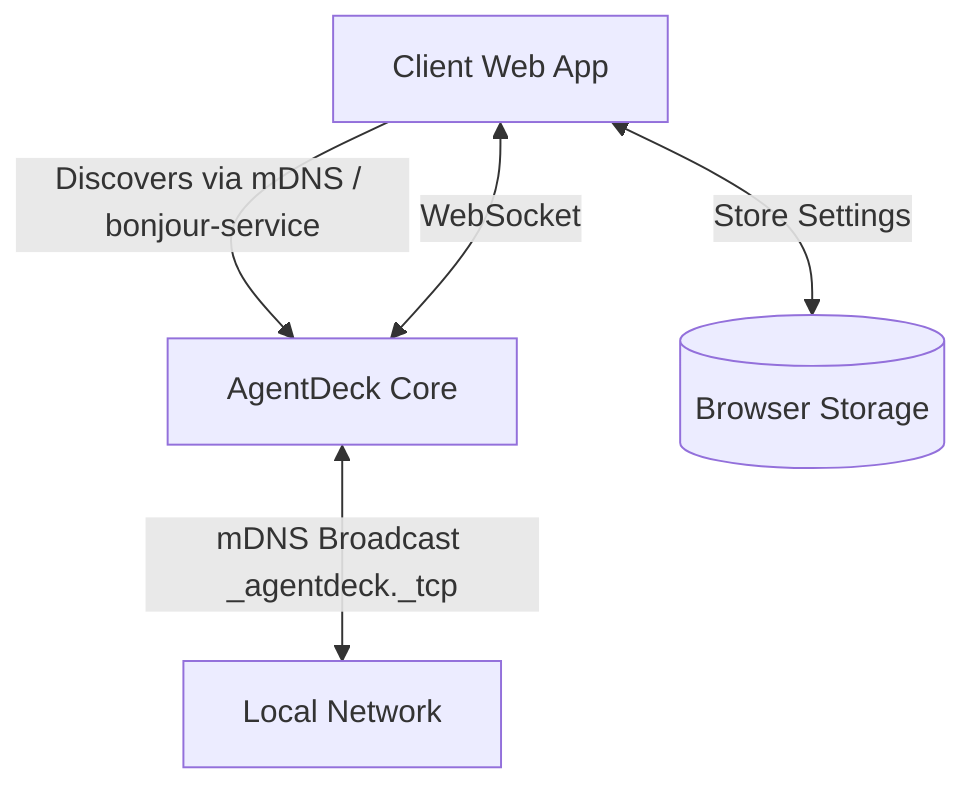

# Development Workstation Specification

## Level 2: Product Requirements
- The subsystem MUST allow the AgentDeck UI (Client) to run on a lightweight laptop while the Core runs on a separate machine on the local network.
- Discovery of the local Core server MUST be zero-configuration on the LAN.

## Purpose
This document defines the architecture, responsibilities, and user experience for the Development Workstation subsystem. It ensures AgentDeck can operate in a decoupled client-server model over a local network.

## User Experience
- **Developer Settings**: The Client UI provides a Developer Settings panel.
- **Zero Configuration (Deferred)**: Ideally, a developer on a laptop on the same Wi-Fi network as their desktop should open AgentDeck Web, enable Developer Mode, and see their Desktop automatically listed as a target workstation. *Note: Currently, mDNS discovery is deferred, and users must manually add the workstation IP and port.*
- **One-Click Connect**: Connecting to a workstation sets it as the active backend for WebSockets and API calls.
- **Auto-Reconnect**: If the Core server restarts, the Client seamlessly reconnects when it comes back online.

## Responsibilities

### AgentDeck Core (The Workstation)
- **Workstation Discovery Service**: Broadcasts its presence over the LAN via mDNS (`_agentdeck._tcp`).
- Continues running Agent Runtime, Event Bus, API, etc.

### AgentDeck Client
- **Workstation Selector/Manager**: Monitors the network for available workstations, stores saved workstations, handles reconnection strategy, and monitors connection health.

## Product Boundaries
- The workstation discovery is currently limited to Local Area Networks (LAN) utilizing mDNS.
- Future evolution may include wide-area remote cloud workstations (via Cloud Relay), but local LAN is the priority boundary.

## Architecture

### Lifecycle
1. **Startup**: Core server initializes `bonjour-service` and publishes `_agentdeck._tcp` on its configured port.
2. **Discovery**: Client, if running a capable discovery process or via manual entry fallback, identifies the IP and port.
3. **Session Management**: Client establishes WebSocket connection to the discovered IP.
4. **Health Monitoring**: Client uses WebSocket `ping`/`pong` or standard disconnect events. Upon disconnect, Client enters a reconnect loop.

## Security
- Discovery broadcasts do not contain sensitive data, only hostnames and ports.
- The standard AgentDeck Core security mechanisms (Approval Gates, local scoping) continue to apply regardless of where the Client runs.

## Limitations & Fallback
- mDNS requires a network that allows multicast. Corporate or guest Wi-Fi networks may block it.
- **Fallback**: The Client provides a manual IP/Port entry field in Developer Settings for networks where mDNS fails.

## Future Evolution
- Implementing a full Cloud Relay for connections across the public internet.
