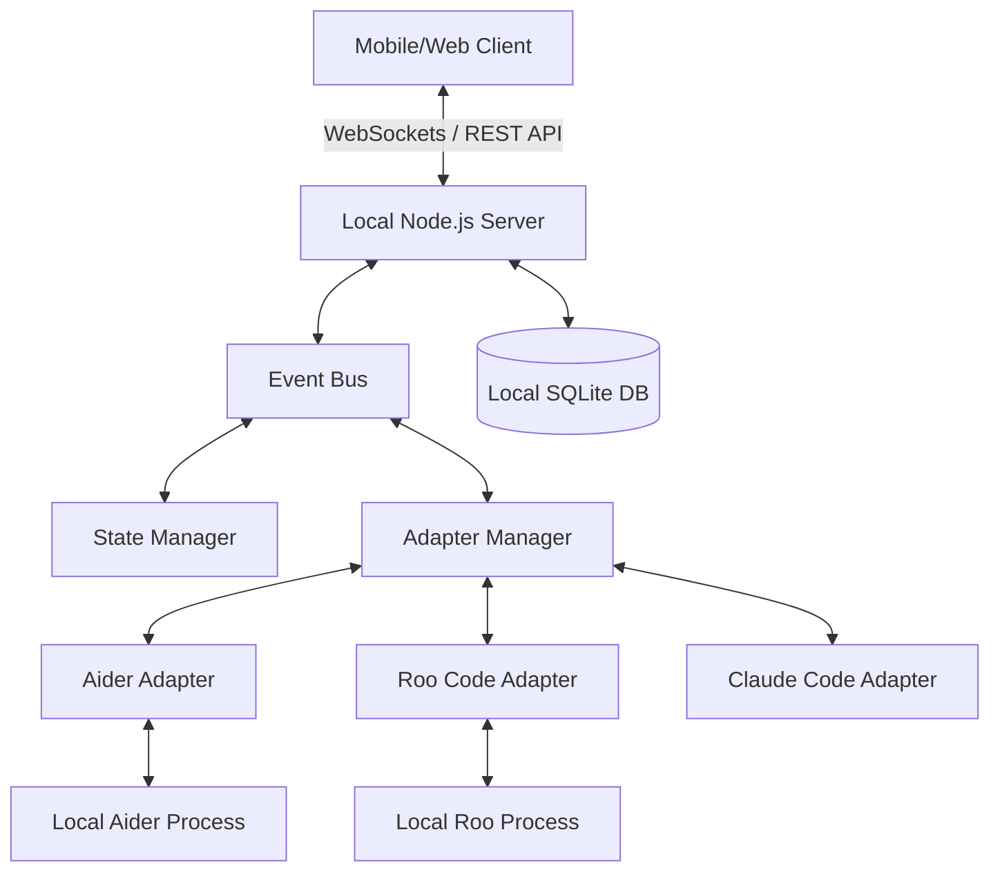

# AgentDeck Architecture

## Product Vision
AgentDeck is a local-first control center for AI coding agents. It provides developers with a structured, AI-native interface to monitor and control coding agents running on their computers. A single application supports different license tiers, allowing free local usage (Community) while unlocking cloud features (Pro) and team collaboration (Enterprise) via subscriptions.

## System Architecture
AgentDeck uses an event-driven, adapter-based architecture. The system consists of:
1. **Core Engine**: Manages event routing, state, and coordination.
2. **Agent Adapters**: Pluggable modules that interface with specific AI agents (e.g., Claude Code, Aider, Roo Code, Antigravity).
3. **Websocket Server**: Provides real-time bidirectional communication with client devices.
4. **Dashboard Client**: A responsive web application (mobile-first) serving as the UI.
5. **Local Database**: Stores project metadata, session history, and configuration.

## High Level Diagram

## Module Descriptions
- **API/Server Module**: Exposes REST endpoints for configuration and WebSocket endpoints for real-time telemetry.
- **Event Bus Module**: Central pub/sub system for all internal communication.
- **Adapter Module**: Standardized interface for interacting with different agents. Handles standardizing agent outputs (logs, diffs, state) into AgentDeck events.
- **Project Monitor Module**: Watches the file system and Git repository to report file modifications and project status independently of the agent.
- **Approval System Module**: Intercepts actions requiring user approval from the adapters and routes them to the client.

## Event System Design
The Event System is the backbone of AgentDeck. It is fully asynchronous.
- **Topics**: `agent.log`, `agent.status`, `agent.approval_request`, `file.changed`, `git.diff`, `client.command`, `client.approval_response`.
- **Payload Structure**: All events follow a strict schema containing `timestamp`, `source` (adapter/client id), `type`, and `payload`.

## Adapter System Design
Adapters implement a common `IAgentAdapter` interface:
- `start(config)`
- `stop()`
- `sendCommand(cmd)`
- `onEvent(callback)`
New agents can be supported by writing a new adapter that maps the agent's stdout/stderr/API to the AgentDeck event schemas.

## API Design
- **REST**: `/api/v1/projects`, `/api/v1/agents`, `/api/v1/sessions`. Used for fetching historical data, configuration, and initialization.
- **GraphQL (Optional future)**: For complex queries over project histories.

## Websocket Design
- **Protocol**: Socket.IO for robust fallback and broadcasting.
- **Rooms**: Each active project or session is a room. Clients join rooms to receive localized telemetry.
- **Parallel Agent Sessions**: The server and WebSocket architecture is designed to support **Parallel Agent Execution**. Multiple distinct agent processes (e.g., Aider, Claude, Antigravity) can run simultaneously in the same project, orchestrating different tasks concurrently.
- **Message Types**: Telemetry updates (one-way server-to-client), commands (client-to-server), and approval handshakes (bidirectional).

## Security Model
- **Local Network Only (MVP)**: Server binds to local network IP. 
- **Authentication**: A pairing PIN or QR code system is required for a new device on the local network to authenticate with the local server.
- **Authorization**: All destructive commands (e.g., executing arbitrary shell commands, git pushes) require explicit approval.

## Local Network Communication
The server will broadcast its presence on the local network using mDNS (Bonjour/Zeroconf) so mobile clients can discover the AgentDeck server automatically without manual IP entry.

## SaaS & Cloud Strategy (Monetization & Licensing)
AgentDeck is distributed as a single application that unlocks features based on the user's license, authenticated via the marketing website.

### 1. Community Edition (Open Source)
- **Cost**: Free.
- **Features**: Local LAN access only, local server, agent management, logs, start/stop agents. No cloud access.

### 2. Pro (Cloud Subscription)
- **Cost**: Monthly subscription.
- **Features**: Remote access from anywhere via Cloud Relay tunnel, user account synchronization, mobile app with push notifications, session history, backups, and auto-updates.

### 3. Enterprise
- **Cost**: Organization/per-user subscription.
- **Features**: Team management, RBAC (Role-Based Access Control), SSO, audit logs, REST API, priority support, and optional On-Premise cloud relay deployment.

The local AgentDeck app will prompt the user to log in to their cloud account to verify their subscription tier and unlock Pro/Enterprise capabilities.

## Application UI Strategy
- **Phase 1**: Responsive PWA (Progressive Web App) served directly from the local server.
- **Phase 2**: UI Overhaul introducing a global Main Dashboard (for Personal Profile and global stats) with a persistent Project Sidebar for quick switching. Adding Advanced File Viewer and Split-pane Git Diff.
- **Phase 3**: Native wrapper (React Native or similar) to handle push notifications for approval requests.

## Database Strategy
- **MVP**: Local SQLite. It requires zero setup from the user, stores data in a single file, and is fast enough for single-user concurrent access.
- **Schema**: Tables for `Projects`, `Threads/Chat Sessions` (to support multiple isolated chats per project), `Events` (pruned periodically), and `Settings`.

## Deployment Strategy
- **Distribution**: npm package (`npm install -g agentdeck`) or single executable binaries via pkg/nexe.
- **Updates**: Auto-update mechanism for the server and web client.

## Scalability Considerations
- **Event Throttling**: High-frequency logs from agents must be batched and throttled before sending over WebSockets.
- **Log Pruning**: Historical logs will grow fast; the database must auto-prune logs older than X days or limit by size.
- **Adapter Isolation**: Misbehaving agent processes shouldn't crash the main AgentDeck process. Adapters may eventually run in separate child processes or worker threads.
