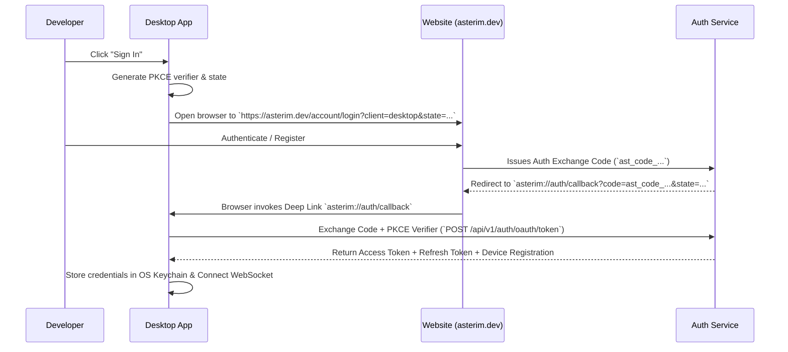

# Asterim Phase 2 — Commercial Authentication & Account Platform Roadmap

**Document Version**: 2.0.0  
**Date**: August 7, 2026  
**Status**: Approved Architectural Masterplan  
**Execution Target**: PR16 through PR28  

---

## 1. Vision & Architectural Principles

Phase 2 builds the **Authentication & Commercial Account Platform** for Asterim. It transitions Asterim from an unauthenticated local tool into a commercial SaaS platform with local execution capabilities.

### Strict Product Separation
1. **The Public Website (`asterim.dev` / `apps/marketing`)**: Owns Identity, Account Registration, Subscription Billing Architecture, Device Control, Session Governance, and Entitlement Allocation.
2. **The Asterim Application (`apps/web` & `apps/server`)**: Consumes Identity, executes agent Orchestration, manages local PTYs, and enforces local security boundaries.
3. **Core Mandate**: Registration NEVER occurs inside the desktop application UI. The website owns identity; the app consumes identity.

---

## 2. Global Architecture Specifications

### 2.1 Multi-Environment Authentication Model (Third Task)
The authentication architecture supports three deployment modes out of the box without code modifications:
* **Local Development / Offline Mode**: Uses a local developer token or machine key stored in OS keychain. Allows 100% offline agent orchestration.
* **Self-Hosted Enterprise Mode**: Uses on-premise OAuth2 / OIDC authentication pointing to self-hosted `@asterim/server` instances.
* **Commercial SaaS Mode**: Centralized JWT + Cookie authentication via `asterim.dev`.

#### Token & Credential Strategy:
* **Access Tokens**: Short-lived (15 minutes) RS256/HS256 JWTs carrying `userId`, `accountId`, `sessionId`, `deviceId`, and `entitlements`.
* **Refresh Tokens**: Long-lived (30 days) cryptographically random opaque strings (`ast_rt_...`), stored as SHA-256 hashes in database with strict single-use rotation.
* **Web Storage**: `HttpOnly`, `SameSite=Lax`, `Secure` cookies for browser sessions on `asterim.dev`.
* **Desktop Storage**: OS Native Keychain (via system keyring) for refresh tokens; in-memory React state for access tokens.
* **CLI Storage**: Encrypted token file inside `~/.asterim/credentials.json` with `0600` file permissions.

---

### 2.2 Account System Schema (Fourth Task)
The database schema (`SQLite` locally, `PostgreSQL` in SaaS) introduces a unified account model:

```sql
-- Users (Identity)
CREATE TABLE users (
    id TEXT PRIMARY KEY,
    email TEXT UNIQUE NOT NULL,
    password_hash TEXT NOT NULL,
    full_name TEXT,
    avatar_url TEXT,
    is_email_verified BOOLEAN DEFAULT FALSE,
    created_at INTEGER NOT NULL,
    updated_at INTEGER NOT NULL
);

-- Accounts & Subscription State
CREATE TABLE accounts (
    id TEXT PRIMARY KEY,
    owner_user_id TEXT NOT NULL REFERENCES users(id),
    account_name TEXT NOT NULL,
    current_plan_id TEXT NOT NULL DEFAULT 'plan_free',
    subscription_status TEXT NOT NULL DEFAULT 'active', -- active, past_due, canceled, trialing
    billing_status TEXT NOT NULL DEFAULT 'ok',          -- ok, payment_failed, grace_period
    stripe_customer_id TEXT,
    plan_expires_at INTEGER,
    created_at INTEGER NOT NULL,
    updated_at INTEGER NOT NULL
);

-- Feature Entitlements
CREATE TABLE feature_entitlements (
    id TEXT PRIMARY KEY,
    account_id TEXT NOT NULL REFERENCES accounts(id),
    feature_key TEXT NOT NULL,                         -- cloud_sync, teams, remote_relay, mcp_marketplace
    is_enabled BOOLEAN DEFAULT TRUE,
    usage_limit INTEGER DEFAULT -1,                    -- -1 for unlimited
    current_usage INTEGER DEFAULT 0,
    expires_at INTEGER,
    UNIQUE(account_id, feature_key)
);

-- User Sessions
CREATE TABLE user_sessions (
    id TEXT PRIMARY KEY,
    user_id TEXT NOT NULL REFERENCES users(id),
    device_id TEXT NOT NULL,
    refresh_token_hash TEXT UNIQUE NOT NULL,
    ip_address TEXT,
    user_agent TEXT,
    client_type TEXT NOT NULL,                         -- desktop, browser, mobile, cli
    is_revoked BOOLEAN DEFAULT FALSE,
    last_active_at INTEGER NOT NULL,
    created_at INTEGER NOT NULL,
    expires_at INTEGER NOT NULL
);

-- Trusted Devices
CREATE TABLE trusted_devices (
    id TEXT PRIMARY KEY,
    user_id TEXT NOT NULL REFERENCES users(id),
    device_name TEXT NOT NULL,
    os_type TEXT NOT NULL,                             -- macos, linux, windows, ios, android
    os_version TEXT,
    client_version TEXT NOT NULL,
    hardware_fingerprint TEXT,
    is_trusted BOOLEAN DEFAULT TRUE,
    last_active_at INTEGER NOT NULL,
    created_at INTEGER NOT NULL
);

-- API Keys
CREATE TABLE api_keys (
    id TEXT PRIMARY KEY,
    account_id TEXT NOT NULL REFERENCES accounts(id),
    user_id TEXT NOT NULL REFERENCES users(id),
    key_name TEXT NOT NULL,
    key_prefix TEXT NOT NULL,                          -- ast_ak_live_...
    key_hash TEXT UNIQUE NOT NULL,
    scopes_json TEXT NOT NULL,
    last_used_at INTEGER,
    expires_at INTEGER,
    created_at INTEGER NOT NULL
);
```

---

### 2.3 Feature Entitlement Layer (Fifth Task)
Authentication MUST NOT determine permissions. Identity resolves to Entitlements, which resolve to Permissions.

```
Authentication → Identity (User) → Account (Plan) → Entitlements → Feature Access
```

#### Application Permission Evaluation:
The application asks: `"Can this account use this feature?"` (`canAccessFeature('remote_relay')`), NEVER `"Is this account Pro?"`.

```typescript
export interface FeatureEntitlementService {
  canAccessFeature(accountId: string, featureKey: FeatureKey): Promise<boolean>;
  getFeatureLimit(accountId: string, featureKey: FeatureKey): Promise<number>;
  recordFeatureUsage(accountId: string, featureKey: FeatureKey, amount?: number): Promise<void>;
}
```

---

### 2.4 Public Website Pages & Structure (Sixth Task)
The public website (`asterim.dev` located in `apps/marketing`) is the commercial hub:

#### Commercial Public Routes:
* `/` — High-converting Landing Page with dynamic visuals & feature grid.
* `/features` — Interactive feature showcase & architecture deep-dive.
* `/pricing` — Plan comparison matrix (Free, Pro, Team, Enterprise).
* `/docs` — Documentation portal & API references.
* `/download` — Multi-platform desktop installer download portal.
* `/roadmap` — Public roadmap & feature voting.
* `/blog` — News, release notes, and technical articles.

#### Authenticated Account Portal Routes (`/account/*`):
* `/account/login` — Account Sign In page.
* `/account/register` — Account Registration page.
* `/account/dashboard` — Account Overview & Plan Usage.
* `/account/settings` — Profile management, Name, Avatar, Password change.
* `/account/security` — MFA settings, Password update, Security events.
* `/account/sessions` — Multi-session management & Remote Logout controls.
* `/account/devices` — Trusted Devices roster, OS info, Revoke device button.
* `/account/billing` — Subscription details, Payment method (placeholder), Invoices.
* `/account/teams` — Team workspace management (Phase 3 readiness).
* `/account/api-keys` — Developer API Keys generation & revocation.
* `/account/downloads` — Direct desktop build downloads for Windows/macOS/Linux.

---

### 2.5 OAuth & Deep-Link Authentication Flow (Seventh Task)



---

### 2.6 Day-One Subscription Architecture (Eighth Task)
Support initial tier structures without hardcoded business logic:
* **Free Plan (`plan_free`)**: Local execution, standard AI adapters, single active device, basic logging.
* **Pro Plan (`plan_pro`)**: Cloud Relay tunnel, multi-device sync, priority execution, unlimited API keys.
* **Team Plan (`plan_team`)**: Shared team workspaces, centralized audit logging, RBAC, team billing.
* **Enterprise Plan (`plan_enterprise`)**: Custom SSO/SAML, air-gapped deployment, dedicated SLA, custom models.

Decoupled payment gateway webhooks update `accounts.subscription_status` and `feature_entitlements` asynchronously via standard events (`subscription.updated`, `payment.failed`).

---

### 2.7 Trusted Device Management (Ninth Task)
The desktop application automatically registers its device hardware fingerprint upon login:
* `device_name`: Hostname (e.g. `MacBook-Pro.local`)
* `os_type`: `macos` | `linux` | `windows`
* `os_version`: OS version string
* `client_version`: Asterim app version (e.g. `v1.5.0`)
* `hardware_fingerprint`: SHA-256 of CPU/Motherboard UUID
* Remote Revocation: Revoking a device immediately invalidates all associated sessions.

---

### 2.8 Session Management & Remote Revocation (Tenth Task)
Sessions are tracked centrally on `asterim.dev`.
* Central UI displays active sessions with OS icon, Location (IP), Browser/Client type, and Last Active timestamp.
* Single-click `"Log Out Other Sessions"` or `"Revoke Session"` invalidates the refresh token in the DB and broadcasts a WebSocket session revocation event.

---

## 3. Production PR Breakdown (PR16 to PR28)

Each PR is scoped to **exactly 1 production feature**, is independently buildable, independently verifiable, and has a clear rollback strategy.

---

### PR16: Authentication & Account Domain Foundation
* **Purpose**: Establish core TypeScript types, interfaces, schemas, and error codes for identity, accounts, sessions, devices, and entitlements in `@asterim/shared`.
* **Files Affected**:
  * `packages/shared/src/types/auth.ts` [NEW]
  * `packages/shared/src/types/account.ts` [NEW]
  * `packages/shared/src/types/entitlements.ts` [NEW]
  * `packages/shared/src/index.ts` [MODIFY]
* **Dependencies**: None.
* **Migration Steps**: Pure type definitions; zero DB migrations.
* **Risk**: Low (type additions only).
* **Rollback Path**: Revert git commit.
* **Verification**: `pnpm --filter @asterim/shared build` and `pnpm --filter @asterim/shared typecheck`.

---

### PR17: Database Schema & Migration Engine
* **Purpose**: Create SQLite migration scripts and database service methods for `users`, `accounts`, `feature_entitlements`, `user_sessions`, `trusted_devices`, and `api_keys`.
* **Files Affected**:
  * `apps/server/src/services/DatabaseService.ts` [MODIFY]
  * `apps/server/src/db/migrations/002_phase2_auth_schema.sql` [NEW]
  * `apps/server/src/db/schema.ts` [NEW]
* **Dependencies**: PR16.
* **Migration Steps**: Execute DB schema migration on server startup (`UP` migration idempotent).
* **Risk**: Low (additive table creations).
* **Rollback Path**: Run SQL `DOWN` migration script dropping phase 2 tables.
* **Verification**: Start server, verify SQLite tables created cleanly via `.schema` query, test DB unit tests.

---

### PR18: Password Hashing & JWT Security Engine
* **Purpose**: Implement Argon2id password hashing, RS256/HS256 JWT access token signing, refresh token hashing, and Fastify auth middleware decorators.
* **Files Affected**:
  * `apps/server/src/services/PasswordService.ts` [NEW]
  * `apps/server/src/services/TokenService.ts` [NEW]
  * `apps/server/src/middleware/authMiddleware.ts` [MODIFY]
  * `apps/server/package.json` [MODIFY - add `argon2`, `jsonwebtoken`]
* **Dependencies**: PR17.
* **Migration Steps**: Replace legacy `PairingService` HMAC signing with `TokenService`.
* **Risk**: Medium (Core auth service changes).
* **Rollback Path**: Revert auth middleware to legacy `PairingService.validateToken`.
* **Verification**: Unit tests for password hashing, JWT signing/verification, expired token rejection.

---

### PR19: Centralized Web Auth APIs
* **Purpose**: Implement core REST auth endpoints on `@asterim/server`: `/api/v1/auth/register`, `/login`, `/logout`, `/refresh`, `/me` with secure `HttpOnly` cookies.
* **Files Affected**:
  * `apps/server/src/routes/auth.ts` [MODIFY]
  * `apps/server/src/controllers/AuthController.ts` [NEW]
* **Dependencies**: PR18.
* **Migration Steps**: Mount new auth routes alongside legacy `/pair` route for smooth transition.
* **Risk**: Medium.
* **Rollback Path**: Feature flag toggle `ENABLE_PHASE2_AUTH=false`.
* **Verification**: Integration test suite verifying HTTP register, login, cookie setting, token refresh, and logout.

---

### PR20: Public Website Auth UI & Navigation
* **Purpose**: Implement modern, dark-mode-first Login and Register pages on `apps/marketing` (`asterim.dev`), matching Asterim Design System tokens.
* **Files Affected**:
  * `apps/marketing/src/pages/Login.tsx` [NEW]
  * `apps/marketing/src/pages/Register.tsx` [NEW]
  * `apps/marketing/src/components/AuthLayout.tsx` [NEW]
  * `apps/marketing/src/App.tsx` [MODIFY]
* **Dependencies**: PR19.
* **Migration Steps**: Add route handlers in `apps/marketing`.
* **Risk**: Low (Frontend UI additions).
* **Rollback Path**: Revert UI routes.
* **Verification**: Manual browser verification of login and registration UX on `apps/marketing`.

---

### PR21: Desktop OAuth Deep-Link Authentication Flow
* **Purpose**: Implement PKCE flow and `asterim://auth/callback` protocol handler in desktop app and `/api/v1/auth/oauth/token` exchange endpoint on server.
* **Files Affected**:
  * `apps/server/src/routes/auth.ts` [MODIFY]
  * `apps/web/src/hooks/useAuth.ts` [MODIFY]
  * `apps/web/src/components/OAuthCallbackHandler.tsx` [NEW]
* **Dependencies**: PR20.
* **Migration Steps**: Register custom protocol handler `asterim://` in desktop app config.
* **Risk**: Medium (OS deep-linking edge cases).
* **Rollback Path**: Fallback to manual token paste modal if deep-link fails.
* **Verification**: Trigger desktop login, observe browser redirect, verify deep-link callback token exchange in < 2s.

---

### PR22: Multi-Session Management & Remote Revocation
* **Purpose**: Implement `/api/v1/sessions` API and UI in account portal to view active sessions (browser, desktop, CLI) and execute single-click remote revocation.
* **Files Affected**:
  * `apps/server/src/routes/sessions.ts` [NEW]
  * `apps/server/src/services/SessionService.ts` [NEW]
  * `apps/marketing/src/pages/account/SessionsPage.tsx` [NEW]
* **Dependencies**: PR19.
* **Migration Steps**: Add session tracking hooks on token refresh and route requests.
* **Risk**: Low.
* **Rollback Path**: Disable session revocation check hook.
* **Verification**: Log in on two browser tabs and desktop app; click "Revoke Session" on website; verify desktop app session is immediately terminated.

---

### PR23: Trusted Device Management Engine
* **Purpose**: Implement automatic trusted device registration on desktop login, hardware fingerprinting, and device revocation UI.
* **Files Affected**:
  * `apps/server/src/routes/devices.ts` [NEW]
  * `apps/server/src/services/DeviceService.ts` [NEW]
  * `apps/marketing/src/pages/account/DevicesPage.tsx` [NEW]
* **Dependencies**: PR21.
* **Migration Steps**: Send client device payload during OAuth code exchange.
* **Risk**: Low.
* **Rollback Path**: Bypass device registration check.
* **Verification**: Connect desktop client, inspect `devices` table for OS/version entry, rename device in UI, revoke device and test access denial.

---

### PR24: Developer API Keys Engine
* **Purpose**: Implement machine-to-machine API Keys (`ast_ak_live_...`), SHA-256 key hashing, scope permissions, and API key management UI.
* **Files Affected**:
  * `apps/server/src/routes/apikeys.ts` [NEW]
  * `apps/server/src/services/ApiKeyService.ts` [NEW]
  * `apps/marketing/src/pages/account/ApiKeysPage.tsx` [NEW]
* **Dependencies**: PR19.
* **Migration Steps**: Add `ApiKey` header authentication strategy to Fastify auth middleware.
* **Risk**: Low.
* **Rollback Path**: Revert API key authentication header check.
* **Verification**: Generate API key on portal, test REST endpoint with `X-API-Key` header, verify access granted.

---

### PR25: Feature Entitlement & Authorization System
* **Purpose**: Build `FeatureEntitlementService` and replace hardcoded plan checks with `canAccessFeature('...')` policy checks across server routes and WebSocket handlers.
* **Files Affected**:
  * `apps/server/src/services/EntitlementService.ts` [NEW]
  * `apps/server/src/middleware/entitlementGuard.ts` [NEW]
  * `apps/web/src/hooks/useEntitlements.ts` [NEW]
* **Dependencies**: PR17.
* **Migration Steps**: Wrap feature routes with `entitlementGuard('feature_key')`.
* **Risk**: Medium (Route authorization changes).
* **Rollback Path**: Set all feature entitlement guards to default to `true`.
* **Verification**: Create test accounts with Free vs Pro entitlements; verify restricted endpoints block Free accounts with 403 Forbidden.

---

### PR26: Account Portal & Dashboard Pages
* **Purpose**: Build complete authenticated Account Portal pages on `apps/marketing` (`/account/dashboard`, `/account/settings`, `/account/security`, `/account/billing`, `/account/downloads`).
* **Files Affected**:
  * `apps/marketing/src/pages/account/DashboardPage.tsx` [NEW]
  * `apps/marketing/src/pages/account/SettingsPage.tsx` [NEW]
  * `apps/marketing/src/pages/account/SecurityPage.tsx` [NEW]
  * `apps/marketing/src/pages/account/BillingPage.tsx` [NEW]
  * `apps/marketing/src/pages/account/DownloadsPage.tsx` [NEW]
  * `apps/marketing/src/components/AccountLayout.tsx` [NEW]
* **Dependencies**: PR20, PR22, PR23, PR24.
* **Migration Steps**: Add account portal navigation sidebar and sub-routes.
* **Risk**: Low (UI additions).
* **Rollback Path**: Revert navigation links.
* **Verification**: End-to-end visual and functional walkthrough of all account portal sections.

---

### PR27: Subscription Architecture & Commercial Plan Engine
* **Purpose**: Build `Plan` data model, `Free`, `Pro`, `Team`, `Enterprise` tier definitions, usage limits schema, and payment gateway webhook handlers (`/api/v1/webhooks/stripe`).
* **Files Affected**:
  * `apps/server/src/services/PlanService.ts` [NEW]
  * `apps/server/src/routes/webhooks.ts` [NEW]
  * `apps/marketing/src/pages/PricingPage.tsx` [MODIFY]
* **Dependencies**: PR25.
* **Migration Steps**: Mount webhook route handlers for billing events.
* **Risk**: Low (Architecture ready without active payment processor enforcement).
* **Rollback Path**: Disable webhook listener.
* **Verification**: Simulate Stripe subscription update webhook payload; verify account plan and feature entitlements update in DB automatically.

---

### PR28: Final Security Audit, E2E Verification & Documentation Sync
* **Purpose**: Conduct end-to-end security audit, OWASP vulnerability check, WebSocket reconnection stress testing, and documentation synchronization.
* **Files Affected**:
  * `docs/phase2-completion-report.md` [NEW]
  * `blueprint/CURRENT_STATE.md` [MODIFY]
  * `blueprint/ROADMAP.md` [MODIFY]
* **Dependencies**: PR16 through PR27.
* **Migration Steps**: Mark Phase 2 as complete in Blueprint.
* **Risk**: Low.
* **Rollback Path**: N/A.
* **Verification**: 100% test pass rate across unit, integration, and E2E auth test suites.

---

## 4. Implementation Schedule & Roadmap Matrix

```
PR16 (Types & Foundation)
  ↓
PR17 (DB Migration & Schema)
  ↓
PR18 (Password & JWT Engine)
  ↓
PR19 (Web Auth REST APIs)
  ↓
PR20 (Website Auth UI)
  ↓
PR21 (Desktop OAuth Flow)
  ↓
PR22 (Session Mgmt)  ───┐
  ↓                     │
PR23 (Device Mgmt)   ───┼───► PR26 (Account Portal UI)
  ↓                     │
PR24 (API Keys)      ───┘
  ↓
PR25 (Entitlement System)
  ↓
PR27 (Subscription Architecture)
  ↓
PR28 (Security Audit & E2E Sync)
```
