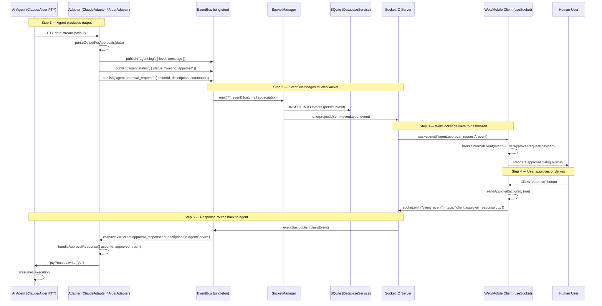
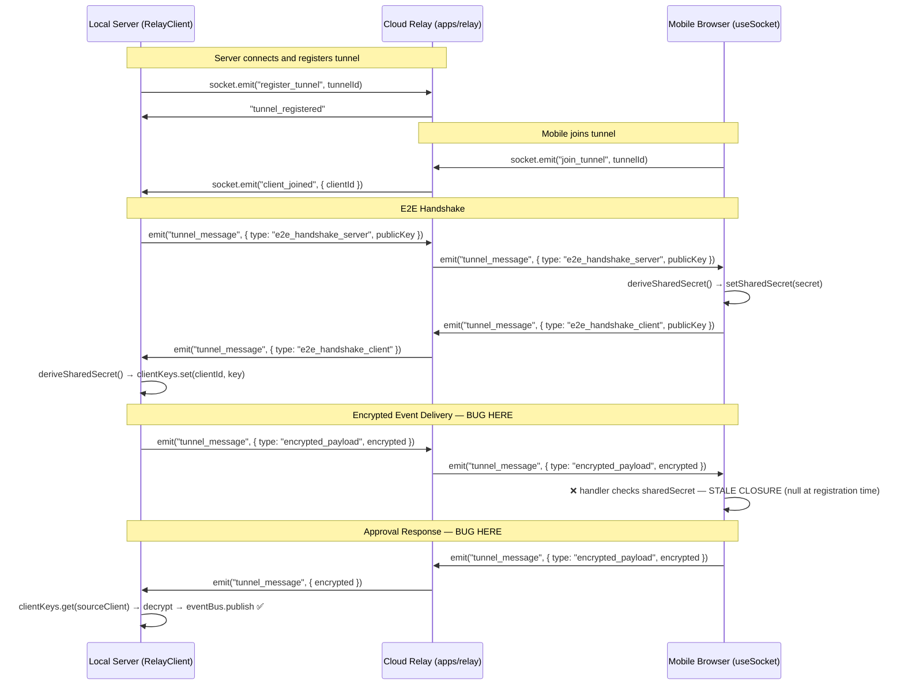

# AgentDeck — Golden Loop Verification

**Date:** 2026-06-19  
**Purpose:** Prove or disprove that the core product loop works end-to-end.

> The Golden Loop is the single most important thing AgentDeck must do:
> **Agent → EventBus → WebSocket → Mobile Dashboard → Approval → Resume Agent Execution**

---

## Sequence Diagram



---

## Step-by-Step Verification

### Step 1: Agent → Adapter (Output Capture)

| Claim | Code Reference | Status |
|---|---|---|
| PTY spawns agent process | `ClaudeAdapter.ts:23-29` | ✅ IMPLEMENTED |
| PTY data piped to `emitLog` | `ClaudeAdapter.ts:31-33` | ✅ IMPLEMENTED |
| Output parsed for approval prompts | `ClaudeAdapter.ts:83-113` | ⚠️ PARTIAL |
| `agent.status` emitted on approval | `ClaudeAdapter.ts:96` | ✅ IMPLEMENTED |
| `agent.approval_request` emitted | `ClaudeAdapter.ts:99-110` | ✅ IMPLEMENTED |

**Issue — PARTIAL:** Approval detection in `ClaudeAdapter.ts:91` uses regex `/?\\s*(.*?)\\s*\\([yY]\\/[nN]\\)/i`. Claude's prompts vary across versions and are not guaranteed to match this pattern. Real-world test coverage does not exist.

**Issue — PARTIAL:** `AiderAdapter.ts:93` uses `/(Allow.*|Run command.*)\\s*\\([yY]\\/[nN]\\)/i`. Aider's exact prompts change with releases. If the regex misses the prompt, the agent hangs waiting for input and no approval request is sent to the client.

---

### Step 2: Adapter → EventBus (Internal Pub/Sub)

| Claim | Code Reference | Status |
|---|---|---|
| `adapter.onEvent(callback)` registered | `AgentService.ts:80-84` | ✅ IMPLEMENTED |
| Adapter callback calls `eventBus.publish` | `AgentService.ts:83` | ✅ IMPLEMENTED |
| `projectId` injected into payload | `AgentService.ts:82` | ✅ IMPLEMENTED |
| EventBus singleton active | `EventBus.ts:14-19` | ✅ IMPLEMENTED |
| Wildcard `'*'` subscription works | `EventBus.ts:27` | ⚠️ QUIRK |

**Issue — QUIRK:** `EventBus.ts:27` emits `this.emitter.emit('*', event)` treating `'*'` as a literal event name. Node's `EventEmitter` does not support wildcards. This is functional only because all consumers (`socketManager.ts:70`, `RelayClient.ts:75`) subscribe to the literal string `'*'`. This is an undocumented contract, not a real wildcard. If any future code subscribes to `'*'` expecting wildcard behavior, it works coincidentally — but the pattern will mislead engineers.

---

### Step 3: EventBus → WebSocket → Client (Real-time Delivery)

| Claim | Code Reference | Status |
|---|---|---|
| SocketManager subscribes to `'*'` | `socketManager.ts:70` | ✅ IMPLEMENTED |
| Events routed to project room | `socketManager.ts:75` | ✅ IMPLEMENTED |
| Events persisted to SQLite | `socketManager.ts:78-91` | ✅ IMPLEMENTED |
| Client socket receives typed events | `useSocket.ts:122-125` | ✅ IMPLEMENTED |
| `handleInternalEvent` updates React state | `useSocket.ts:92-111` | ✅ IMPLEMENTED |
| Approval dialog shown to user | `App.tsx:157-179` | ✅ IMPLEMENTED |

**This step is the most complete link in the chain.** Events flow from EventBus to Socket.IO room to client state to UI correctly in the local (same-network) mode.

---

### Step 4: Client → User → Approval Response (Mobile)

| Claim | Code Reference | Status |
|---|---|---|
| Approval dialog renders | `App.tsx:157-179` | ✅ IMPLEMENTED |
| Approve/Deny buttons exist | `App.tsx:174-175` | ✅ IMPLEMENTED |
| `sendApproval` called on click | `App.tsx:174` | ✅ IMPLEMENTED |
| `sendApproval` emits `client.approval_response` | `useSocket.ts:170-173` | ✅ IMPLEMENTED |
| Local mode: `socket.emit("client_event", ...)` | `useSocket.ts:162` | ✅ IMPLEMENTED |

**Note:** In local mode (same network), this step works correctly. Push notifications (`PushService.ts:88-98`) also attempt to notify mobile clients of pending approvals.

---

### Step 5: Approval Response → Agent Resume (Critical Path)

| Claim | Code Reference | Status |
|---|---|---|
| Server receives `client_event` | `socketManager.ts:37-40` | ✅ IMPLEMENTED |
| `client_event` published to EventBus | `socketManager.ts:39` | ✅ IMPLEMENTED |
| `AgentService` subscribed to `client.approval_response` | `AgentService.ts:58-68` | ✅ IMPLEMENTED |
| Adapter's `handleApprovalResponse` called | `AgentService.ts:65` | ✅ IMPLEMENTED |
| Adapter sends `y\r` or `n\r` to PTY | `ClaudeAdapter.ts:73-79` | ✅ IMPLEMENTED |
| Agent process receives keypress and resumes | PTY write → agent stdin | ✅ EXPECTED (PTY) |

---

## Relay Path (Remote Mobile Access)

The Golden Loop has a **critical bug** when accessed via the cloud relay (i.e., the user is outside their home network).

### Relay Golden Loop Sequence



### Relay Bugs

**Bug 1 — Stale Closure (`useSocket.ts:61`):**
```typescript
// useSocket.ts line 61 — BUG
} else if (message.type === 'encrypted_payload' && sharedSecret) {
```
`sharedSecret` here is the value captured at the time the `useEffect` ran (null initially). Even after `setSharedSecret(secret)` is called, the already-registered event listener still holds the null reference. **Result: All encrypted payloads from the server are silently dropped by the mobile client.**

**Fix:** Use a `useRef` to hold `sharedSecret` and read `.current` inside the handler.

**Bug 2 — Relay URL Hardcoded to localhost:**
- `RelayClient.ts:25`: `this.socket = io('http://localhost:4000')`
- `useSocket.ts:26`: `newSocket = io('http://localhost:4000')`

The relay is intended to be a **cloud service** to enable remote access. But both the server and the web client are connecting to `localhost:4000`. A mobile device outside the local network cannot reach `localhost:4000`. **The relay feature is non-functional for its intended use case.**

---

## Missing Links Summary

| Link | Status | Severity |
|---|---|---|
| Agent PTY → Adapter output capture | ✅ Functional | — |
| Adapter → EventBus publish | ✅ Functional | — |
| Approval regex (Claude) | ⚠️ Fragile, untested at scale | HIGH |
| Approval regex (Aider) | ⚠️ Fragile, untested at scale | HIGH |
| EventBus wildcard `'*'` | ⚠️ Works but misleading pattern | LOW |
| EventBus → SocketManager bridge | ✅ Functional | — |
| SQLite event persistence | ✅ Functional | — |
| WebSocket → Client (local mode) | ✅ Functional | — |
| Approval dialog in UI | ✅ Functional | — |
| User approval → server (local mode) | ✅ Functional | — |
| Server → adapter `handleApprovalResponse` | ✅ Functional | — |
| Adapter → PTY `y\r`/`n\r` | ✅ Functional | — |
| **Relay E2E sharedSecret closure** | ❌ **BROKEN** | **CRITICAL** |
| **Relay URL not cloud** | ❌ **BROKEN** | **CRITICAL** |
| **ApprovalManager integration** | ❌ Dead code, unused | HIGH |
| Codex/Roo/Antigravity adapters | ❌ Not implemented | HIGH |
| Authentication of approval sender | ❌ Not implemented | CRITICAL |
| Approval persistence (crash recovery) | ❌ Not implemented | HIGH |
| Log event pruning | ❌ Not implemented | MEDIUM |

---

## Validation Results

### Local Mode Golden Loop
**VERDICT: FUNCTIONAL IN HAPPY PATH**

When running locally (server and client on same network):
1. Agent starts via `client.command` → PTY spawns ✅
2. Agent output streams to client via EventBus → Socket.IO ✅
3. If agent produces a prompt matching the regex, approval dialog appears ✅
4. User approves → `y\r` sent to PTY ✅
5. Agent resumes ✅

**Caveats:**
- Regex-based approval detection has not been tested against current Claude Code or Aider versions
- No authentication — any device on the network can send commands
- Server crash loses the session entirely

### Relay Mode Golden Loop
**VERDICT: NON-FUNCTIONAL**

- E2E handshake completes correctly (key exchange works)
- But the `sharedSecret` stale closure bug means the mobile client cannot decrypt any incoming events
- The relay URL points to localhost, so external mobile devices cannot connect at all
- The relay golden loop is **completely broken for its intended remote-access use case**

### Simulated/Mocked Components
There are **no simulated or mocked components** in the production code — all implementations are real but some are incomplete or broken.
